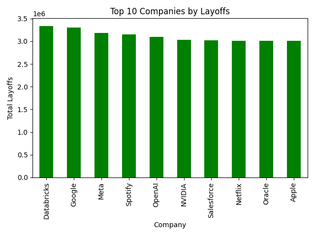

# 📊 Global Tech Layoffs Analysis


## 📌 Project Overview

This project analyzes global technology sector layoffs using Python, Pandas, and Matplotlib.

The objective was to explore layoff trends across industries, countries, companies, and years and generate meaningful business insights through data analysis and visualization.

This project was built as part of my Data Analytics learning journey to strengthen my skills in data cleaning, exploratory data analysis (EDA), aggregation, and data visualization.

---

## 🎯 Objectives

- Analyze layoffs across different industries.
- Identify countries with the highest layoffs.
- Find companies with the largest workforce reductions.
- Analyze yearly layoff trends.
- Create visualizations to communicate insights effectively.

---

## 🛠️ Tools & Technologies

- Python
- Pandas
- Matplotlib
- VS Code
- GitHub

---

## 📂 Dataset Information

- Total Records: **12,000**
- Total Columns: **23**
- Missing Values: **0**
- Duplicate Records: **0**

### Key Features

- Company Name
- Industry
- Country
- Layoffs Count
- Layoff Percentage
- AI Automation Impact
- AI Replacement Risk
- Hiring Trend
- AI Adoption Level
- Employee Sentiment
- Job Security Score
- Market Condition

---

## 🔍 Data Analysis Performed

### 1️⃣ Industry Analysis

Analyzed total layoffs across industries to identify the sectors most affected by workforce reductions.

### 2️⃣ Country Analysis

Compared layoffs across countries to determine the regions experiencing the highest layoffs.

### 3️⃣ Company Analysis

Identified the top 10 companies with the highest number of layoffs.

### 4️⃣ Yearly Trend Analysis

Analyzed layoffs by year to understand overall workforce reduction trends.

---

## 📈 Visualizations

The following visualizations were created:

- Total Layoffs by Industry
- Total Layoffs by Country
- Top 10 Companies by Layoffs
- Total Layoffs by Year

---

## 💡 Key Insights

### Insight 1
Social Media recorded the highest total layoffs among all industries in the dataset.

### Insight 2
The UK recorded the highest total layoffs among all countries analyzed.

### Insight 3
Databricks recorded the highest total layoffs among all companies in the dataset.

### Insight 4
Layoff volumes remained relatively consistent across the analyzed years.

---

## 📁 Project Structure

```text
Global-Tech-Layoffs-Analysis/
│
├── data/
│   └── tech_layoffs_hiring_trends_elite_v2.csv
│
├── analysis.py
├── README.md
│
├── industry_layoffs.png
├── country_layoffs.png
├── top_companies.png
└── yearly_layoffs.png
```

---

## 🚀 Skills Demonstrated

- Data Cleaning
- Exploratory Data Analysis (EDA)
- Data Aggregation
- GroupBy Operations
- Data Visualization
- Business Insight Generation
- Python Programming
- Pandas
- Matplotlib

---


## ⭐ Project Outcome

This project helped strengthen my understanding of real-world data analysis workflows, from loading and cleaning data to generating insights and creating professional visualizations.

I will continue building more projects involving Python, SQL, Power BI, and Business Analytics to further develop my Data Analytics portfolio.
